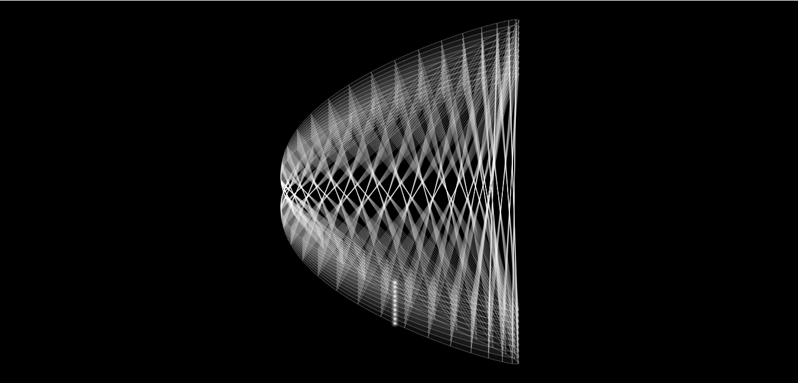

# Orbit8
Animated mathematical art consisting of a series of curves rotating about a central point. 

How does it work?
-----------------
The project is made up of a stack of 10 Lissajous curves with a lobe ratio of 2:1 rotating
at the same phase angle about a center.  
The curves are vertically stacked by maintaining a constant relative width whiles varying the relative height 
of each curve.  

 
## Getting Started

These instructions will get you a copy of the project up and running on your local machine for development and testing purposes. 

### Prerequisites

All you'll ever need is a working web browser. That's it.

### Installing
Open the index.html file in your web browser. It's that simple.  
 
## Built With

* Javascript   

## Authors 

* **Caleb Nii Tetteh Tsuru Addy** 
 
## License

This project is licensed under the GNU General Public License v3.0.
